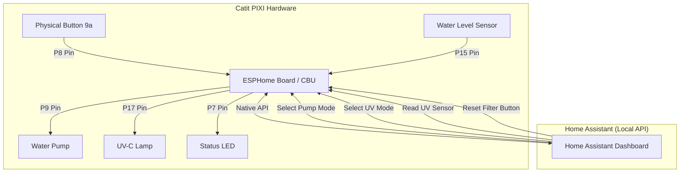

# Catit PIXI Smart Fountain - ESPHome Local Integration

Transform your cloud-locked **Catit PIXI Smart Fountain (Model #43751)** into a fully local, privacy-respecting smart home device using **ESPHome** and **Home Assistant**. By bypassing the official Tuya cloud, you gain complete local control over the water pump, UV-C sterilizer, water level sensor, and the physical button, all while keeping the hardware intact.

---

## 🚀 What and Why?

### The Problem

Commercial smart pet fountains typically rely on proprietary cloud ecosystems (like Tuya). If the internet drops, your app stops working, and your data routes through external servers. Furthermore, if the manufacturer shuts down their servers, the "smart" features become useless plastic.

### The Solution

This project replaces the original stock firmware on the internal Tuya CBU Wi-Fi module with an **ESPHome** firmware.

* **100% Local Control:** Operates directly via the Home Assistant Native API. No cloud, no lag, no privacy leaks.
* **Autonomous Safety Features:** Logic runs directly on the board's microcontroller, ensuring safety features (like the dry-run protection) work even if Home Assistant or your Wi-Fi goes down.
* **Exact Notice Parity:** Implements official operating modes, including the 1-hour active / 7-hour pause UV cycle and the intermittent pump flow mode.

---

## 🔌 Flashing & UART Connections (Crucial Warning!)
Unlike the side test pads (GPIOs), to flash the fountain's CBU module:

* Do not use the left-side test pads.
* Use the pin holes located on the right side of the module.
* It is strongly recommended to temporarily solder a Dupont connector strip (or header pins) into these right-side pin holes to securely connect your UART adapter without loose connections while toggling the CEN pin to enter flash mode.

---

## 🛠️ Hardware Reverse-Engineering & Pinout

Through careful exploration, the internal pin mapping for the Tuya CBU module inside the Catit PIXI was mapped as follows:

| Component | Pin (GPIO) | Type | Description |
| --- | --- | --- | --- |
| **Water Pump** | `P9` | Switch | Controls the 5V water pump power. |
| **UV-C Sterilizer** | `P17` | Switch | Controls the UV-C clarifier lamp. |
| **Water Level Sensor** | `P15` | Binary Sensor | Connected to the pump's internal feedback line (`INPUT_PULLUP`, inverted). Detects dry-run status when the pump is active. |
| **Physical Button** | `P8` | Binary Sensor | Located on the back (`9a`). Used for short presses to reset filters. |
| **Status LED** | `P7` | Switch | Internal indicator LED (Active Low / Inverted logic). |

---

## 📊 Architecture & Data Flow

The following Mermaid diagram illustrates how the local hardware components interact with the ESPHome board and Home Assistant:



---

## 📝 Complete ESPHome Configuration (`yaml`)

Create a new device in ESPHome and use the following complete configuration file:

```yaml
esphome:
  name: fontaine-chat
  friendly_name: fontaine-chat
  on_boot:
      priority: 600 
      then:
        - script.execute: gestion_cycle_pompe
        - if:
            condition:
              lambda: 'return id(mode_uv).current_option() == "Automatique";'
            then:
              - script.execute: cycle_uv_auto

bk72xx:
  board: cbu

logger:

api:
  reboot_timeout: 2min

ota:

wifi:
  ssid: "YOUR_WIFI_SSID"
  password: "YOUR_WIFI_PASSWORD"

time:
  - platform: sntp
    id: my_time
    timezone: "Europe/Paris"
  
number:
  - platform: template
    name: "Jours avant changement de filtre"
    id: filtre_jours_restants
    min_value: 0
    max_value: 30
    initial_value: 30
    step: 1
    optimistic: true
    icon: "mdi:air-filter"
    entity_category: diagnostic

select:
  - platform: template
    name: "Mode de la Pompe"
    id: mode_pompe
    icon: "mdi:water-pump-outline"
    options:
      - "Arrêt"
      - "Continu"
      - "Intermittent (5m ON / 15m OFF)"
    initial_option: "Continu"
    optimistic: true
    on_value:
      then:
        - script.execute: gestion_cycle_pompe

  - platform: template
    name: "Mode Lampe UV"
    id: mode_uv
    icon: "mdi:auto-fix"
    options:
      - "Automatique"
      - "Manuel"
    initial_option: "Automatique"
    optimistic: true
    on_value:
      then:
        - if:
            condition:
              lambda: 'return x == "Automatique";'
            then:
              - logger.log: "Mode UV : Automatique activé"
              - script.execute: cycle_uv_auto
            else:
              - logger.log: "Mode UV : Manuel activé"
              - script.stop: cycle_uv_auto
              - switch.turn_off: lampe_uv
          
button:
  - platform: template
    name: "Réinitialiser le filtre"
    id: reset_filtre_btn
    icon: "mdi:restart"
    on_press:
      then:
        - number.set:
            id: filtre_jours_restants
            value: 30
        - logger.log: "Compteur de filtre réinitialisé à 30 jours."

  - platform: restart
    name: "Redémarrer la fontaine"
    id: restart_board

interval:
  - interval: 24h
    then:
      - lambda: |-
          // Récupère la valeur actuelle et retire 1, sans descendre en dessous de 0
          int current = id(filtre_jours_restants).state;
          if (current > 0) {
            id(filtre_jours_restants).publish_state(current - 1);
          }
          
switch:
  - platform: gpio
    pin: P9
    name: "Pompe Fontaine"
    id: pompe
    icon: "mdi:water-pump"

  - platform: gpio
    pin:
      number: P7
      inverted: true
    id: led_statut
    name: "LED Statut"

  - platform: gpio
    pin: P17
    name: "Interrupteur Lampe UV"
    id: lampe_uv
    icon: "mdi:car-light-high"
    on_turn_on:
      - if:
          condition:
            lambda: 'return id(mode_uv).current_option() == "Manuel";'
          then:
            - script.execute: minuteur_manuel_uv
    on_turn_off:
      - if:
          condition:
            lambda: 'return id(mode_uv).current_option() == "Manuel";'
          then:
            - script.stop: minuteur_manuel_uv
    
script:
  - id: cycle_uv
    mode: restart
    then:
      - logger.log: "Démarrage du cycle UV : 1 heure actif"
      - switch.turn_on: lampe_uv
      - delay: 1h
      - logger.log: "Pause UV : 7 heures de repos"
      - switch.turn_off: lampe_uv
      - delay: 7h
      - script.execute: cycle_uv
  
  - id: gestion_cycle_pompe
    mode: restart
    then:
      - lambda: |-
          std::string mode = id(mode_pompe).current_option();
          
          if (mode == "Arrêt") {
            id(pompe).turn_off();
          } else {
            id(pompe).turn_on();
          }
      
      - while:
          condition:
            lambda: 'return id(mode_pompe).current_option() == "Intermittent (5m ON / 15m OFF)";'
          then:
            - switch.turn_on: pompe
            - delay: 5min
            - switch.turn_off: pompe
            - delay: 15min

  - id: cycle_uv_auto
    mode: restart
    then:
      - while:
          condition:
            lambda: 'return id(mode_uv).current_option() == "Automatique";'
          then:
            - switch.turn_on: lampe_uv
            - delay: 1h
            - switch.turn_off: lampe_uv
            - delay: 7h

  - id: minuteur_manuel_uv
    mode: restart
    then:
      - delay: 1h
      - switch.turn_off: lampe_uv
              
binary_sensor:
  - platform: gpio
    pin:
      number: P15
      mode: INPUT_PULLUP
      inverted: true
    name: "Capteur Niveau d'Eau"
    id: capteur_eau
    device_class: problem

  - platform: gpio
    pin:
      number: P8
      mode: INPUT_PULLUP
      inverted: true
    name: "Bouton Physique"
    id: bouton_physique
    on_click:
      # Appui court (entre 50ms et 2 secondes) : Reset du filtre
      - min_length: 50ms
        max_length: 2s
        then:
          - button.press: reset_filtre_btn
          - logger.log: "Bouton (Appui court) : Reset du filtre effectué !"
      
      # Appui long (plus de 5 secondes) : Redémarrage de la carte
      - min_length: 5s
        max_length: 60s
        then:
          - logger.log: "Bouton (Appui long) : Redémarrage matériel en cours..."
          - button.press: restart_board

  - platform: template
    name: "Statut Lampe UV"
    id: statut_lampe_uv
    lambda: 'return id(lampe_uv).state;'
    icon: "mdi:lightbulb-on-outline"
```

---

## 💡 Features included in Home Assistant

1. **Pump Mode Selector:** Switch dynamically between `Arrêt` (Off), `Continu` (Continuous), and `Intermittent (5m ON / 15m OFF)`.
2. **Water Level Alert:** Displays a warning state (`problem`) inside Home Assistant when the reservoir runs dry while the pump is active.
3. **Filter Life Tracker:** A 30-day countdown tracking filter saturation. Pressing the physical button on the back of the fountain triggers a logic reset back to 30 days, mirroring factory behavior.
4. **Dual-Mode UV Sterilization:**
* **Automatique:** Follows the strict 1-hour active / 7-hour rest cycle autonomously.
* **Manuel:** Allows you to turn the lamp on manually. An internal safety timer will automatically turn it off after 1 hour.
5. **Physical Button Multi-Action:**
* **Short Press:** Triggers a logic reset of the 30-day filter tracker back to 30 days, mirroring factory behavior.
* **Long Press (5 seconds):** Triggers a clean hardware reboot of the ESP board (useful for troubleshooting without unplugging the fountain).
