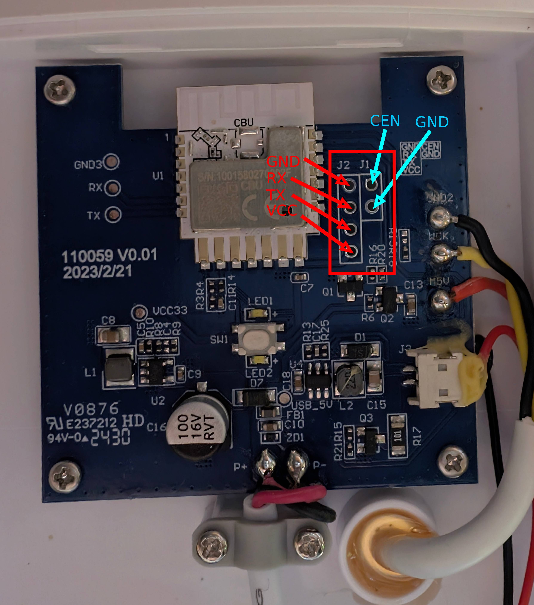
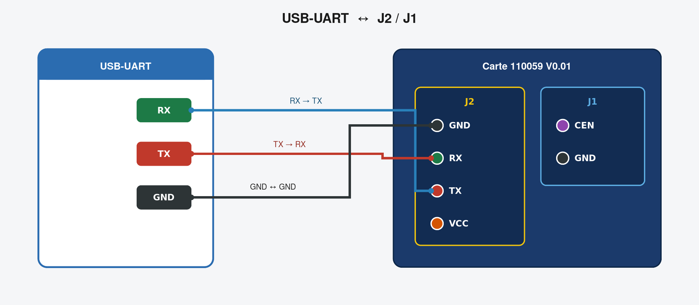
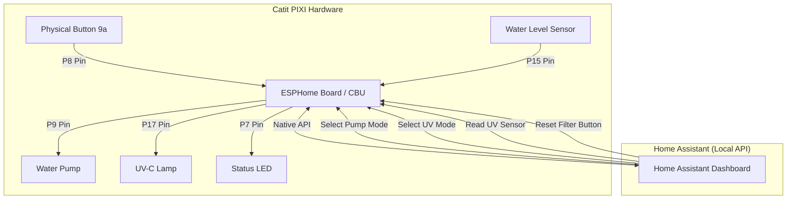

# Catit PIXI Smart Fountain - ESPHome Local Integration

Transform your cloud-locked **Catit PIXI Smart Fountain (Model #43751)** into a fully local, privacy-respecting smart home device using **ESPHome** and **Home Assistant**. By bypassing the official Tuya cloud, you gain complete local control over the water pump, UV-C sterilizer, water level sensor, and the physical button, all while keeping the hardware intact.

---

## 🚀 What and Why?

### The Problem

Commercial smart pet fountains typically rely on proprietary cloud ecosystems (like Tuya). If the internet drops, your app stops working, and your data routes through external servers. Furthermore, if the manufacturer shuts down their servers, the "smart" features become useless plastic.

### The Solution

This project replaces the original stock firmware on the internal Tuya CBU Wi-Fi module with an **ESPHome** firmware.

* **100% Local Control:** Operates directly via the Home Assistant Native API. No cloud, no lag, no privacy leaks.
* **Autonomous Safety Features:** Logic runs directly on the board's microcontroller, ensuring safety features (like the dry-run protection) work even if Home Assistant or your Wi-Fi goes down.
* **Exact Notice Parity:** Implements official operating modes, including the 1-hour active / 7-hour pause UV cycle and the intermittent pump flow mode.

---

## 🔌 Flashing & UART Connections

Since the fountain relies on a Tuya CBU module featuring a Beken BK7231N chip, it requires specific tools designed for the LibreTiny platform rather than standard ESP8266/ESP32 flashers.

### Recommended Tools & Official Documentation
* **[LibreTiny Flashing Guide](https://docs.libretiny.eu/docs/flashing/tools/)**: The official and most comprehensive documentation for flashing Beken chips.
* **[ltchiptool](https://github.com/libretiny-eu/ltchiptool)**: The standard GUI/CLI utility for reading and writing Beken firmwares.
* **[ESPHome BK72xx Component](https://esphome.io/components/bk72xx.html)**: The official ESPHome documentation for the Beken architecture.

### Wiring & Crucial Hardware Warning
To flash the CBU module via a USB-to-TTL adapter, **do not use the 3.3V power from your UART adapter**, as it may not provide enough current. Instead, use the fountain's native power supply and establish a common ground.

* **Do not use the left-side test pads.** They are highly unreliable for flashing.
* **Use the through-holes located on the right side of the module.**
* It is strongly recommended to temporarily solder a Dupont connector strip (or header pins) into these right-side pin holes. A loose connection will inevitably cause flashing failures.

**The Flashing Sequence:**
1. Connect `RX1` to `TX`, `TX1` to `RX`, and `GND` to `GND` between the CBU module and your UART adapter. **Leave the 3.3V UART pin disconnected.**
2. Plug in the fountain's native power supply to turn on the board.
3. Start the flashing process in `ltchiptool` or your chosen web flasher.
4. Momentarily short the `CEN` (Chip Enable) pin to `GND` to reboot the chip into Download Mode, allowing the flasher to catch the bootloader sequence.

---

## 🛠️ Hardware Reverse-Engineering & Pinout

Through careful exploration, the internal pin mapping for the Tuya CBU module inside the Catit PIXI was mapped as follows:

| Component | Pin (GPIO) | Type | Description |
| --- | --- | --- | --- |
| **Water Pump** | `P9` | Switch | Controls the 5V water pump power. |
| **UV-C Sterilizer** | `P17` | Switch | Controls the UV-C clarifier lamp. |
| **Water Level Sensor** | `P15` | Binary Sensor | Connected to the pump's internal feedback line (`INPUT_PULLUP`, inverted). Detects dry-run status when the pump is active. |
| **Physical Button** | `P8` | Binary Sensor | Located on the back (`9a`). Used for short presses to reset filters. |
| **Status LED** | `P7` | Switch | Internal indicator LED (Active Low / Inverted logic). |

---

## 📊 Architecture & Data Flow

The following Mermaid diagram illustrates how the local hardware components interact with the ESPHome board and Home Assistant:

---

## 💡 Features & Exposed Entities

Once integrated, your Home Assistant dashboard will have access to a rich set of entities, automatically restoring their last state upon reboot.

### 🎛️ Exposed Entities Summary

| Home Assistant Entity | Type | Description |
| --- | --- | --- |
| **Mode de la Pompe** | `select` | Switch between *Arrêt*, *Continu*, and *Intermittent (5m ON / 15m OFF)*. State persists across reboots. |
| **Mode Lampe UV** | `select` | Switch between *Automatique* (1h ON / 7h OFF) and *Manuel* (1h safety timer). State persists across reboots. |
| **Jours avant changement...** | `number` | A 30-day decremental counter for the filter life. State persists across reboots. |
| **Temps restant Pompe** | `sensor` (duration) | Real-time countdown timer (HH:MM:SS) for the intermittent pump mode cycle. |
| **Temps restant UV** | `sensor` (duration) | Real-time countdown timer (HH:MM:SS) for the active UV sterilization cycle. |
| **Capteur Niveau d'Eau** | `binary_sensor` | Warns if the reservoir runs dry (Problem class). |
| **Statut Lampe UV** | `binary_sensor` | Read-only indicator showing if the UV lamp is currently shining. |
| **Statut Connexion...** | `binary_sensor` | Connection status, highly recommended for external watchdog automations. |
| **Pompe Fontaine** / **Lampe UV** | `switch` | Direct manual overrides for the hardware components. |
| **Réinitialiser le filtre** | `button` | Software trigger to reset the 30-day filter counter. |
| **Redémarrer la fontaine** | `button` | Software trigger to reboot the ESP board. |

### 🌟 Core Capabilities

1. **Pump Mode Selector:** Switch dynamically between `Arrêt` (Off), `Continu` (Continuous), and `Intermittent (5m ON / 15m OFF)`.
2. **Cycle Timers:** New real-time duration sensors natively outputting the remaining time for the intermittent pump mode and UV cycles directly to your dashboard.
3. **Water Level Alert:** Displays a warning state (`problem`) inside Home Assistant when the reservoir runs dry while the pump is active.
4. **Filter Life Tracker:** A 30-day countdown tracking filter saturation. Pressing the physical button on the back of the fountain triggers a logic reset back to 30 days, mirroring factory behavior.
5. **Dual-Mode UV Sterilization:**
* **Automatique:** Follows the strict 1-hour active / 7-hour rest cycle autonomously.
* **Manuel:** Allows you to turn the lamp on manually. An internal safety timer will automatically turn it off after 1 hour.
6. **Physical Button Multi-Action:**
* **Short Press:** Triggers a logic reset of the 30-day filter tracker back to 30 days, mirroring factory behavior.
* **Long Press (5 seconds):** Triggers a clean hardware reboot of the ESP board (useful for troubleshooting without unplugging the fountain).

---

## 📝 Complete ESPHome Configuration (`yaml`)

Create a new device in ESPHome and use the following complete [configuration file](catit_pixi_water_fountain.yaml)
